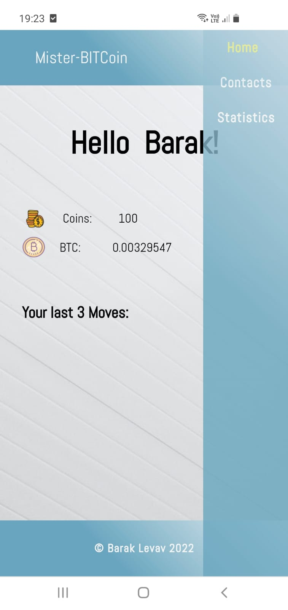

# Mister Bitcoin

Manage a Bitcoin wallet.

## Description

User: Log in to access the wallet.
 
Contacts: Handle a contact list - Add or remove a contact, transfer coins to a specific contact, review the latest transfers you made.
 
Statistics: Review the latest movements in the market.

## Software and Languages used

Angular CLI, SCSS.

Hope you'd like it!

<a href="https://barakz13.github.io/mister-bitcoin/" target="blank">Link to GitHub Pages</a>

